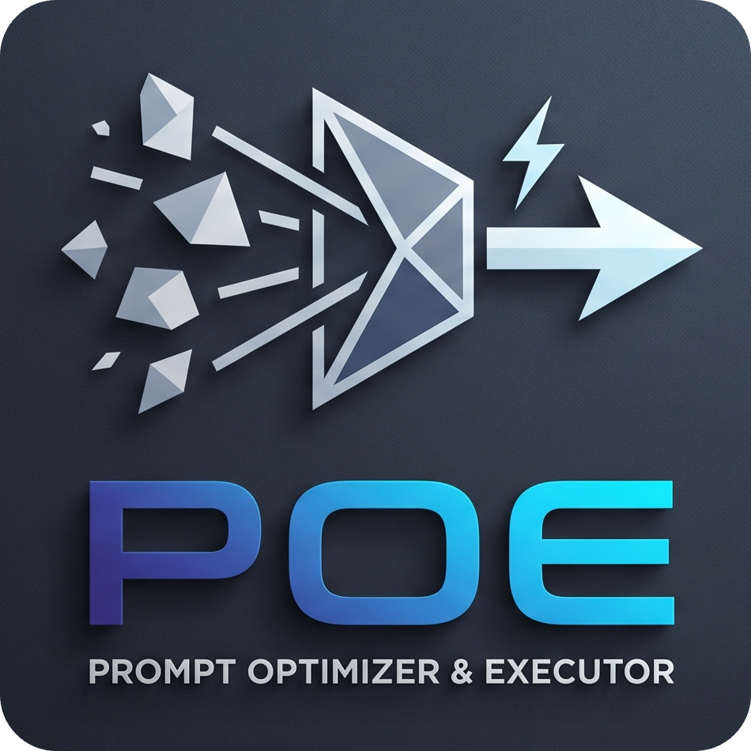

# POE (Prompt Optimizer and Executor)

<br/>
<br/>

<div align="center">
  
</div>

> **A 2nd-Year Academic Project demonstrating Advanced AI Integration, Real-Time Data Streaming, and Token-Based Rate Limiting.**

<div align="center">
  <!-- Core Frameworks -->
  
  
  
  

  <br />

  <!-- Database & State -->
  
  
  

  <br />

  <!-- AI & Security -->
  
  
  

  <br />

  <!-- UI Components & Notifications -->
  
  
</div>

---

## The Problem vs. The Solution

### The Problem

Interacting with Large Language Models (LLMs) requires "Prompt Engineering." Most users fail to get the desired output because they write vague, unstructured, or incomplete prompts. The AI is only as good as the instructions it receives.

### The Solution: POE (Dual-Engine Architecture)

POE eliminates the need for users to be prompt engineers. It uses a **Two-Step AI Architecture**:

1. **Engine 1 (The Optimizer - Google Gemini):** Takes the user's raw, simple task and structures it into a highly detailed, professional Master Prompt using advanced prompting frameworks.
2. **Engine 2 (The Executor - Groq Llama-3):** Takes the optimized Master Prompt and executes it, streaming the final output back to the user at lightning speed.

---

## Visual Walkthrough & UI Flow

### 1. Landing Page

_The entry point of the application explaining the core value proposition._

```text
<!-- TODO: Placeholder: Add Landing Page Screenshot Here -->
```

### 2. User Authentication (Login & Register)

_Secure, JWT-backed authentication flow for user onboarding._

```text
<!-- TODO: Placeholder: Add Login/Register Screenshot Here -->
```

### 3. Main Dashboard (Prompt Builder & Executor)

_The core workspace where users input their tasks, view the optimized prompt, and watch the real-time execution._

```text
<!-- TODO: Placeholder: Add Main Dashboard Screenshot Here -->
```

---

## Tech Stack & Architecture

- **Frontend:** Next.js (App Router), React, Tailwind CSS
- **Backend:** Next.js Route Handlers (`/api`), Node.js
- **Database:** MongoDB (Mongoose ORM)
- **AI & LLMs:**
  - Vercel AI SDK (`ai`, `@ai-sdk/google`, `@ai-sdk/groq`)
  - Google Gemini (`gemini-1.5-flash`) for Prompt Structuring
  - Groq (`llama3-8b-8192`) for Real-Time Execution
- **Security:** `jsonwebtoken` (JWT), `bcryptjs`

---

## Project Structure

```text
# TODO: Directory structure will be mapped here upon frontend completion.
```

## Getting Started (Local Setup)

Follow these steps to run the POE application locally.

### 1. Clone the Repository

```bash
git clone https://github.com/Abhisek-Dash-Official/POE-Prompt-Optimizer-Executer.git
cd poe
```

### 2. Install Dependencies

```bash
npm install
```

### 3. Setup Environment Variables

Create a `.env` file in the root directory. You will need to generate API keys from Google AI Studio and Groq Console.

```env
# Database Configuration
MONGODB_URI=your_mongodb_connection_string

# Security & Authentication
JWT_SECRET=your_super_secret_jwt_key
NEXT_PUBLIC_APP_URL=http://localhost:3000

# AI Provider Keys
GOOGLE_GENERATIVE_AI_API_KEY=your_google_ai_studio_key
GROQ_API_KEY=your_groq_api_key
```

### 4. Run the Development Server

```bash
npm run dev
```

Open [http://localhost:3000](http://localhost:3000) in your browser to start optimizing your prompts!

---

## Key Technical Features

- **Ultra-Fast Streaming:** Utilizes the Vercel AI SDK and Groq's LPU architecture to stream responses word-by-word (`streamText`), delivering a zero-lag user experience.
- **Smart Rate Limiting:** Built-in daily token tracking. Each user is allocated exactly 50 tokens (prompts) per day, automatically resetting at midnight (Server-Side Date Tracking).
- **Secure Authentication:** Custom-built stateless authentication using HTTP-only cookies and JSON Web Tokens (JWT).
- **NoSQL Database:** MongoDB integration for scalable user management and tracking usage metrics.

## Key Learnings & Takeaways

- **Vercel AI SDK:** Learned how to seamlessly connect, manage, and switch between multiple LLM providers (Google & Groq) using a unified, modern SDK.
- **Real-Time Data Streaming:** Implemented `streamText` and data streaming protocols. I learned how to stream data chunks to the frontend word-by-word instead of waiting for long API round-trips, drastically improving User Experience.
- **Dual-Engine Architecture:** Understood the practical application of different AI models—using **Gemini** for its logical structuring/reasoning and **Llama-3 (Groq)** for its raw speed and fast token generation.
